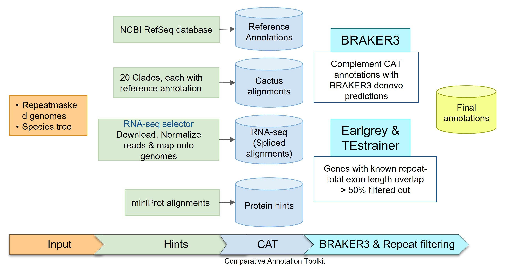

# Drosophila genome annotation pipeline

The provided scripts are used to annotate 304 Drosophila genomes using Comparative Annotation Toolkit (CAT) and BRAKER3. Here is the original publication of CAT which provides detailed background information necessary to understand how CAT works: https://www.ncbi.nlm.nih.gov/pmc/articles/PMC6028123/  and the [GitHub repo](https://github.com/ComparativeGenomicsToolkit/Comparative-Annotation-Toolkit)

## Workflow


## General steps before runnig CAT
There are steps that will need to be performed before you can run the CAT pipeline.

### CAT installation 
To setup the conda environment for annotation and install CAT and all the dependencies follow the steps and instructions given in: [cat_installation.sh](5_CAT/cat_installation.sh)

### Prerequisite data for better gene prediction

#### 1. Obtain genome files and mask repeats
Here is a function to download genome assembly from NCBI provided genome accession and species name. Or you could use your genome assembly.

Usage: ```download_assembly_ftp species_name genome_accession```
```bash
download_assembly_ftp() {
    if [[ $2 = GCF_* ]]
    then
    esearch -db assembly -query $2 </dev/null | esummary| grep 'FtpPath type="RefSeq"'|sed 's/<FtpPath type="RefSeq">//'|sed 's_</FtpPath>__'|sed 's_\s__g' \
     |while read -r url ; do
    fname=$(echo $url | grep -o 'GCF_.*' | sed 's/$/_genomic.fna.gz/') ;
    wget -O "${1}.${2}_genomic.fna.gz"  "$url/$fname" ;
    done;
    else
    esearch -db assembly -query $2 </dev/null | esummary | xtract -pattern DocumentSummary -element FtpPath_GenBank \
     | while read -r url ; do
    fname=$(echo $url | grep -o 'GCA_.*' | sed 's/$/_genomic.fna.gz/') ;
    wget -O "${1}.${2}_genomic.fna.gz" "$url/$fname" ;
    done ;
    fi
}
```

##### *Optional: Repeatmasking 
It is best to softmask repeats in the genome as they will affect the gene predictions. 

```RepeatMasker --species drosophila -pa 16 -xsmall genome```

#### 2. Get all trancriptional data available for your genomes (ESTs, RNA-seq, Transcripts, Isoseq)
CAT uses extrinsic hints (such as RNA-seq, Iso-seq and protein data) to improve the annotation. In AugustusTMR mode, extrinsic hints help fill in missing information in the alignment and resolve evolutionary changes. In AugustusCGP mode, extrinsic hints correct for the inherent false positives produced by the ab initio gene prediction.

##### Download RNA-seq data and align to the genomes
This script [Get_RNAseq/download_rnaseq_and_mapping.sh](Get_RNAseq/download_rnaseq_and_mapping.sh) will download the RNAseq data and align the reads to respective genomes. **Note: Script requires a text file containing scientific species names on each line and your organism's group taxonomy ID (For ex. for Drosophila - 7214).**

Steps involved in the script [Get_RNAseq/download_rnaseq_and_mapping.sh](Get_RNAseq/download_rnaseq_and_mapping.sh):
- Using ENA Portal API, the script downloads a table containing all the trancriptional experiments for the given taxonomy ID.
- It chooses upto 10 RNAseq paired-end reads for the provided list of species (based on the variety of tissue types, sex, and read count with the objective of including all the variety of data available for a particular species).
- Since some of the RNAseq data are quite large and can become unwieldy to work with, RNA-seq reads will be downsampled or normalized to 100x coverage using **BBNorm** (and reads with an apparent depth under 2x will be discarded).
- In the final step, trimmed reads will be mapped to the indexed genomes using **STAR** and then convert the aligned sam file to bam, and sort & index the bam file using **SAMtools** and **sambamba**.

#### 3. Get protein data
You could download protein data for individual species if you have very few genome to annotate. If you are working on the large number of species I would recommend to use a relevant portion of **OrthoDB** protein database as the source of reference protein sequences.
- For example, if your genomes of interest are insects, download arthropoda proteins and concatenate proteins from all species into a single file: 
```bash
wget https://v100.orthodb.org/download/odb10_arthropoda_fasta.tar.gz
tar xvf odb10_arthropoda_fasta.tar.gz
cat arthropoda/Rawdata/* > proteins.fasta
```
- For other group of organisms you can find more specific protein dataset on: https://www.orthodb.org/?page=filelist

### Genome alignments
CAT requires a HAL (Hierarchical Alignment Format) multiple genome alignment, which represents a genome history including any available ancestral reconstructions in an efficiently accessible format.

**Progressive Cactus** is a very efficient tool to generate HAL genome alignments. Cactus requires softmasked genome assemblies and a guide phylogenetic tree relating them. More detailed instructions can be found here: https://github.com/ComparativeGenomicsToolkit/cactus/blob/master/doc/progressive.md

#### 1. Generate a species tree
- **BUSCO analysis:** run BUSCO using gene sets available on OrthoDB.
- This script [phylo_buscov5.sh](3_BUSCO/phylo_buscov5.sh) can then be used to aggregate BUSCOs into clusters of 1:1 orthologs and then multiple sequence alignment using mafft.
  - Generate gene tree inference using **IQTREE2**
  - Generate species tree inference using **ASTRAL**

#### 2. *Optional
If there are large number of species (like in this project >250 spp.) it's better to divide the big phylogenetic tree into subclades/groups of closely related species and/or choose reference species for each subclade. 
- [extract_subclades_1.py](4_Cactus_Alignment/extract_subclades_1.py) creates the rooted species tree for each subclades given a phylogenetic distance (distance of farthest leaf in a subclade).

### Running CAT
Prerequisites before running CAT:
- Get Augustus-cgp trained model parameters from here: http://bioinf.uni-greifswald.de/augustus/datasets/ and make sure Augustus/config folder is writable.
  If you cannot get write permissions, then you will need to copy ```Augustus/config``` directory to the current directory and provide this path to CAT (```--cgp-param path/to/config/folder```).
- Prepare a CAT config file as described here: https://github.com/ComparativeGenomicsToolkit/Comparative-Annotation-Toolkit#config-file
  ```bash
  luigi --module cat RunCat --hal=alignment.hal --ref-genome=Reference_Species --config=config.file \
  --work-dir work_dir --workDir toil_tmpDIR --out-dir out_dir --augustus --local-scheduler --augustus-species fly --augustus-cgp \
  --cgp-param augustus_cfgs/cgp_parameters.cfg --augustus-cgp-cfg-template augustus_cfgs/cgp_extrinsic_template.cfg \
  --tm-cfg augustus_cfgs/extrinsic.ETM1.cfg --tmr-cfg augustus_cfgs/extrinsic.ETM2.cfg --assembly-hub --binary-mode local --workers=65 --maxCores=12
  ```

### Running BRAKER3
Recover genes missed by CAT pipeline:
- Diptera odb10 proteins and RNAseq used as extrinsic hints. Detailed description: [BRAKER3](6_BRAKER3/README.md)

### CATBRAKER
We complemented CAT annotations with the BRAKER annotations. 
- 1-1: Genes found by both pipelines. We compared the CDS length and chose gene with longest complete CDS.
- 1-many & many-1: CAT preferred.
- 1-0 & 0-1: All kept.

### TE masking
Transposable elements are identified by [Earlgrey](https://github.com/TobyBaril/EarlGrey). We filtered out genes if >30% of theire total exon length is within repeat regions.
